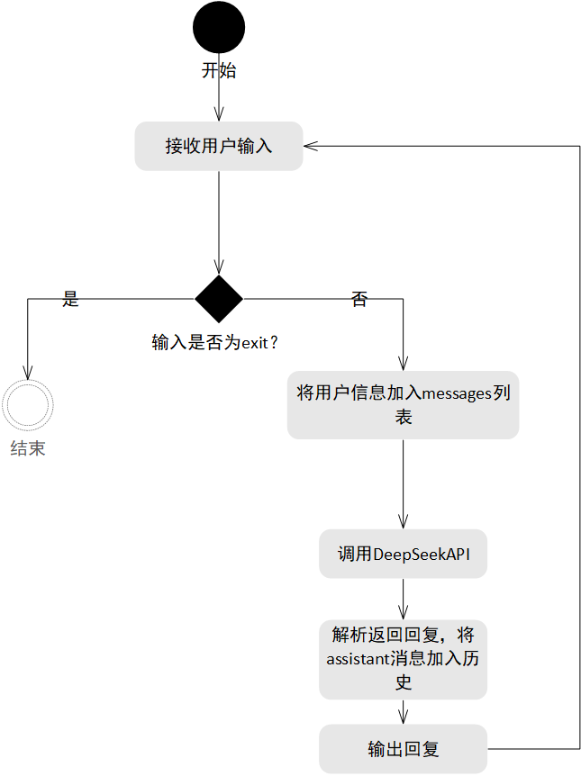
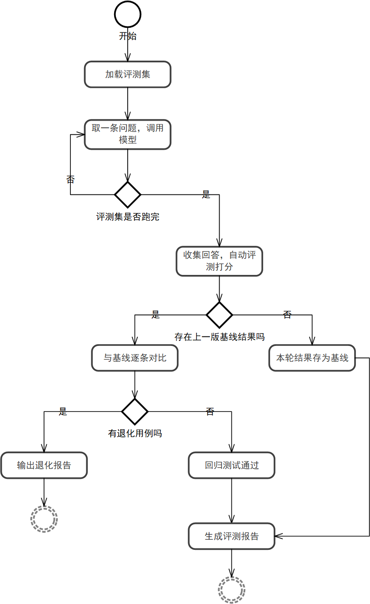

# 健身问答评测与回归测试系统

基于大语言模型的健身问答系统，通过自动化评测与回归测试，
检验模型回答健身问题的准确性与稳定性。
## 项目简介

本项目面向健身领域，调用大模型 API 构建智能问答助手，
并计划通过评测集批量检验回答质量、通过回归测试保证系统迭代不退化。
目前处于早期开发阶段。
## 技术栈

- Python 3
- DeepSeek API（deepseek-chat）
- requests / python-dotenv
- Git / GitHub
## 项目结构

```
fitness-qa-system/
├── chatbot.py                  # 命令行聊天机器人（多轮上下文记忆）
├── requirements.txt            # 项目依赖
├── README.md                   # 项目说明
├── .gitignore                  # Git 忽略规则
```
## 快速开始

1. 克隆仓库
```bash
git clone https://github.com/pangbin-d/fitness-qa-system.git
cd fitness-qa-system
```

2. 安装依赖
```bash
pip install -r requirements.txt
```

3. 配置 API Key：在项目根目录新建 `.env` 文件
```
DEEPSEEK_API_KEY=你的Key
```

4. 运行
```bash
python chatbot.py
```
输入 `exit` 退出对话。
## 当前进度

- [x] 命令行聊天机器人 v0.1（多轮上下文记忆、系统人设）

## 后续计划

- [ ] 评测集构建与批量评测
- [ ] 回答质量打分与回归测试
- [ ] RAG 检索增强

## 系统流程



### 评测与回归测试流程

